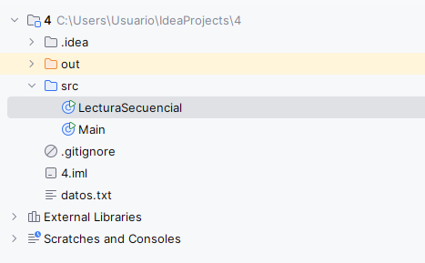
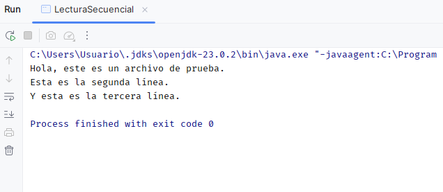
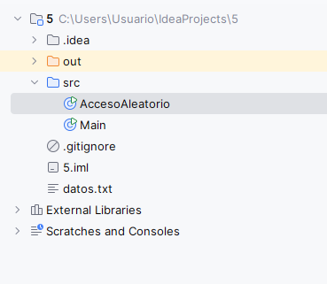
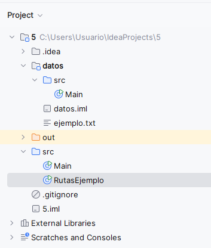
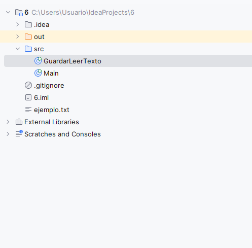
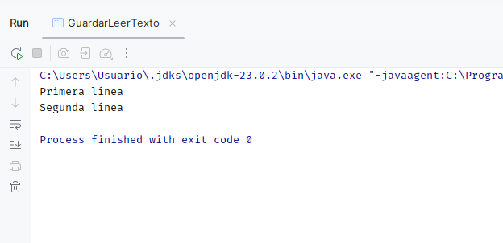

**Descripción**  
Este tema aborda los fundamentos del almacenamiento persistente utilizando ficheros en Java. Estudiaremos qué es la persistencia, por qué es necesaria y cómo se implementa mediante el sistema de ficheros. También se introduce el concepto de acceso secuencial y acceso aleatorio.

## Introducción

Cuando un programa finaliza su ejecución, toda la información almacenada en memoria RAM se pierde. Para conservar los datos entre distintas ejecuciones, es necesario **almacenarlos de forma persistente**.

Una de las formas más sencillas y universales de persistencia es el **uso de ficheros**, que permiten guardar información en disco duro, ya sea en forma de texto plano, binario o estructurado (como XML).

En este tema aprenderás qué tipos de acceso existen a un fichero, qué papel juega el sistema de ficheros del sistema operativo, y cómo Java gestiona este acceso mediante sus clases estándar.

## Desarrollo teórico

### 1. ¿Qué es un fichero?

Un fichero (o archivo) es una **secuencia de bytes almacenada de forma persistente** en un dispositivo de almacenamiento. Se identifica mediante una ruta o «path», y puede contener cualquier tipo de información: texto, imágenes, objetos, etc.

Los ficheros son gestionados por el **sistema de archivos** del sistema operativo, el cual se encarga de:

- Asignar una ruta y un nombre único dentro de un directorio.
    
- Proteger el acceso concurrente mediante permisos.
    
- Garantizar la integridad de los datos.
    

### 2. Acceso a la información: Tipos

En Java, cuando trabajamos con ficheros, podemos acceder a la información de dos maneras principales:

#### **Acceso secuencial**: se lee el fichero de principio a fin, útil para textos planos.

Este es el modo más **básico y común** de acceder a ficheros de texto. Se lee el archivo **desde el principio hasta el final**, **línea a línea o carácter a carácter**, en orden.

##### Ventajas:

- Simple de implementar.
    
- Ideal para archivos pequeños o de lectura completa (como logs, listas, etc).
    

##### Inconvenientes:

- No se puede «saltar» directamente a una línea concreta.
    
- Poco eficiente si solo necesitas una parte específica del archivo.
    

#### Ejemplo en Java:

import java.io.*;

public class LecturaSecuencial {
    public static void main(String[] args) throws IOException {
        BufferedReader br = new BufferedReader(new FileReader("datos.txt"));
        String linea;

        while ((linea = br.readLine()) != null) {
            System.out.println(linea);
        }

        br.close();
    }
}

Este programa lee el archivo **línea por línea** hasta que ya no queden más (cuando `readLine()` devuelve `null`).

#### **Acceso aleatorio (Random Access)**: permite saltar a una posición específica del archivo, ideal para estructuras binarias.

Este modo permite **acceder directamente a una posición específica del archivo**, sin tener que recorrerlo desde el principio.

Para ello se usa la clase `RandomAccessFile`, que funciona como una combinación de lector y escritor. Se puede mover el «puntero» a cualquier parte del archivo con `.seek(posicion)`.

##### Ventajas:

- Muy útil en estructuras con **registros de tamaño fijo**.
    
- Permite **lectura y escritura en cualquier parte del archivo**.
    

##### Inconvenientes:

- Solo se puede usar en ficheros de tipo binario o texto con estructuras muy controladas.
    
- Requiere conocer la estructura exacta del contenido.
    

#### Ejemplo en Java:

import java.io.*;

public class AccesoAleatorio {
    public static void main(String[] args) throws IOException {
        RandomAccessFile raf = new RandomAccessFile("datos.txt", "rw");

        raf.seek(20); // Mover el puntero a la posición 20 (byte 20)
        String linea = raf.readLine(); // Leer desde ahí
        System.out.println("Contenido desde byte 20: " + linea);

        raf.close();
    }
}

)

**Nota**: La posición 20 significa el **byte número 20**, no la línea 20. Para acceder por líneas habría que recorrerlas.

#### Resumen comparativo

|Característica|Acceso Secuencial|Acceso Aleatorio (`RandomAccessFile`)|
|---|---|---|
|Tipo de lectura|Desde el inicio hasta el final|Desde una posición específica|
|Lectura parcial|❌ No directa|✅ Sí|
|Escritura|✅ Sí, al final normalmente|✅ Sí, en cualquier posición|
|Clase principal|`BufferedReader`, `Scanner`|`RandomAccessFile`|
|Ideal para|Archivos de texto|Archivos binarios o con registros fijos|

// Acceso secuencial
BufferedReader br = new BufferedReader(new FileReader("datos.txt"));
String linea;
while ((linea = br.readLine()) != null) {
    System.out.println(linea);
}
br.close();

// Acceso aleatorio
RandomAccessFile raf = new RandomAccessFile("datos.txt", "rw");
raf.seek(20); // ir al byte 20
String linea = raf.readLine();
raf.close();

Actividad

Realizar Actividad 1.1

### 3. Sistema de ficheros y rutas

#### ¿Qué es una ruta?

Una **ruta** es el camino que el sistema operativo necesita para acceder a un archivo o carpeta.

En Java, al trabajar con ficheros, es necesario indicar la **ruta completa** del archivo al que queremos acceder, ya sea para **leerlo**, **escribirlo**, **modificarlo** o **eliminarlo**.

#### Tipos de rutas en Java

#### **Absolutas**: especifican todo el camino desde la raíz del sistema.

Es la ruta **completa** desde el origen del sistema de archivos (la raíz).

- En **Windows**:
    
    C:\\Users\\David\\Documentos\\datos.txt
    
- En **Linux/Mac**:
    
    /home/david/documentos/datos.txt
    

**Ventaja**: Es muy precisa.

**Desventaja**: No es portable entre sistemas ni usuarios.

#### **Relativas**: se refieren a la ubicación del archivo respecto al directorio actual del programa.

Es la ruta en relación al **directorio actual del proyecto Java** (es decir, el «working directory»).

Por ejemplo, si nuestro proyecto está en:

C:/Users/David/IdeaProjects/AccesoADatos/

Y usamos la ruta relativa:

"datos/alumnos.txt"

Java buscará el archivo en:

C:/Users/David/IdeaProjects/AccesoADatos/datos/alumnos.txt

**Ventaja**: Es portable entre sistemas y ordenadores.

**Desventaja**: Puede ser difícil de localizar si no se sabe cuál es el directorio actual.

#### Cómo obtener el directorio actual del proyecto

String base = System.getProperty("user.dir");
System.out.println("Ruta base del proyecto: " + base);

#### Portabilidad con `File.separator`

Los separadores de carpetas son diferentes según el sistema operativo:

- Windows → `\\`
    
- Linux/Mac → `/`
    

En lugar de escribirlo manualmente, usamos:

String separador = File.separator;

#### Ejemplo completo

import java.io.File;

public class RutasEjemplo {
    public static void main(String[] args) {
        String base = System.getProperty("user.dir");
        String sep = File.separator;

        String rutaAbsoluta = base + sep + "datos" + sep + "ejemplo.txt";
        System.out.println("Ruta absoluta generada: " + rutaAbsoluta);

        File archivo = new File(rutaAbsoluta);
        System.out.println("¿Existe el archivo? " + archivo.exists());
    }
}

Este código construye una ruta de forma **portátil** y verifica si el archivo existe.

Recuerda

String separador = File.separator;
String rutaBase = System.getProperty("user.dir");
String ruta = rutaBase + separador + "archivo.txt";

## Ejemplo práctico completo

import java.io.*;

public class GuardarLeerTexto {
    public static void main(String[] args) throws IOException {
        String ruta = System.getProperty("user.dir") + File.separator + "ejemplo.txt";

        // Escritura
        BufferedWriter bw = new BufferedWriter(new FileWriter(ruta));
        bw.write("Primera línea\n");
        bw.write("Segunda línea\n");
        bw.close();

        // Lectura
        BufferedReader br = new BufferedReader(new FileReader(ruta));
        String linea;
        while ((linea = br.readLine()) != null) {
            System.out.println(linea);
        }
        br.close();
    }
}

## Resumen

En este tema hemos aprendido que la persistencia de datos es esencial en cualquier aplicación. Java nos proporciona mecanismos básicos a través de las clases del paquete `java.io` para manejar archivos de texto o binarios, de forma secuencial o aleatoria.

## Tabla comparativa: Acceso secuencial vs aleatorio

|Característica|Acceso Secuencial|Acceso Aleatorio|
|---|---|---|
|Tipo de uso|Lectura lineal, texto|Datos binarios estructurados|
|Clases usadas|FileReader, BufferedReader|RandomAccessFile|
|Velocidad de lectura|Lenta para datos al final|Alta (si conoces la posición)|
|Modificación|Reescribir todo el archivo|Modificar por posiciones|
|Uso de punteros|No|Sí (`seek()` y `getFilePointer()`)|
|Consumo de memoria|Bajo|Moderado|
